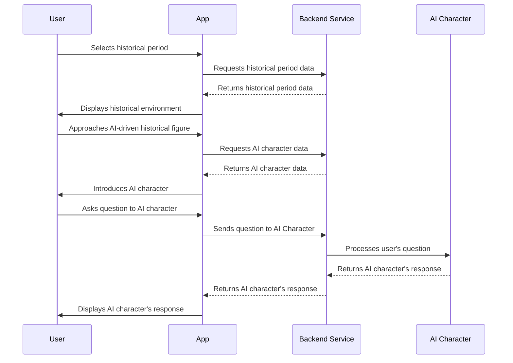
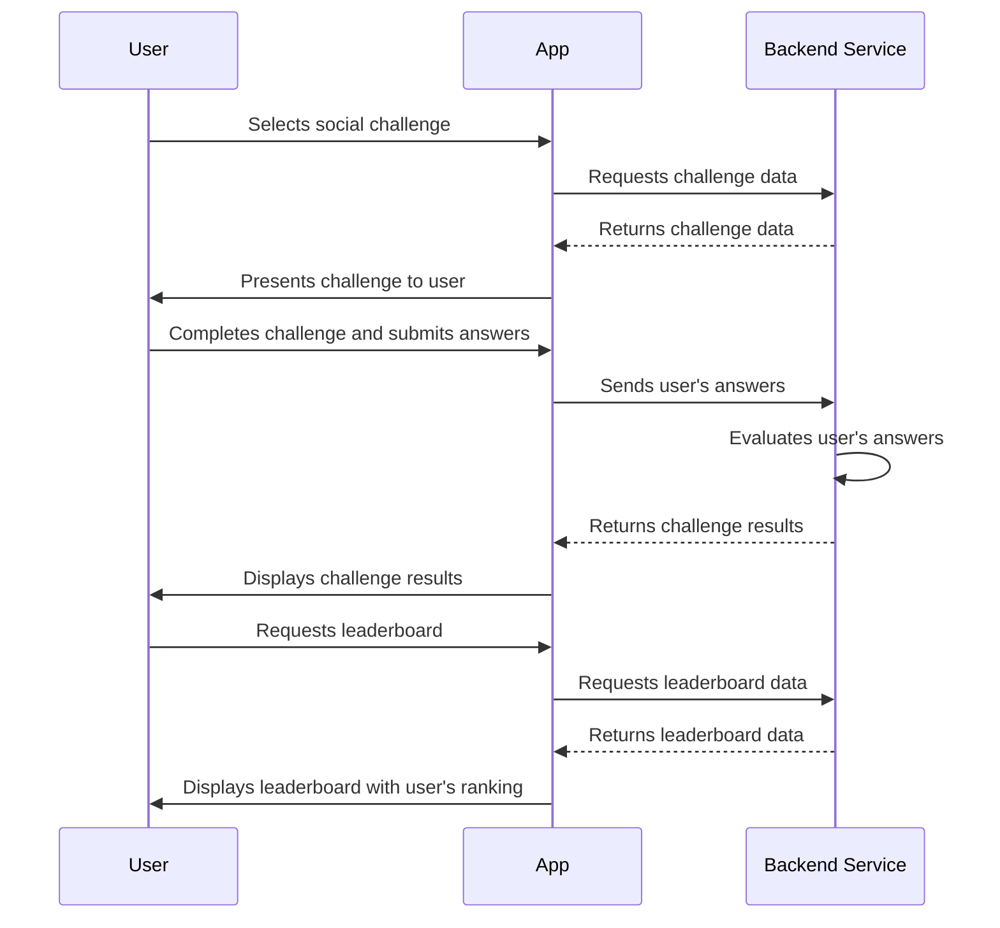

# Design Document: TimeSilkRoad

## 1. Product Name
- TimeSilkRoad

## 2. Introduction
- TimeSilkRoad is a social virtual reality app that transports users back in time to explore historical events and different eras. By combining AI-driven storytelling with immersive virtual reality technology, TimeSilkRoad aims to provide an engaging, educational, and interactive experience. The target audience includes history enthusiasts, educators, students, and anyone interested in experiencing the past through a unique and collaborative platform.

## 3. Goals and Objectives
- Provide users with an immersive and interactive historical experience
- Foster collaboration and social connections among users with shared interests
- Facilitate personalized learning and engagement through AI-driven storytelling
- Increase users' understanding and empathy for different cultures and historical perspectives
- Create a platform for ongoing exploration and community building

## 4. Features and Functionalities
- **Human-AI Interaction**: Users can converse with AI-driven historical figures, asking questions and learning from their experiences. AI characters adapt their responses based on the user's interests and prior knowledge, offering personalized insights and engaging interactions.
- **Collaborative Exploration**: Users can invite friends or join groups with other users who share similar interests, exploring historical settings and events together. They can discuss findings, exchange ideas, and collaborate on solving puzzles or challenges related to the time period.
- **AI-Assisted Role-Playing**: Users can assume the roles of historical figures or fictional characters within the virtual environment. The AI guides users through role-playing scenarios, helping them understand the perspectives, motivations, and challenges of their chosen characters, deepening engagement and fostering empathy.
- **Social Challenges and Leaderboards**: The app introduces history-themed challenges and quizzes for users to compete in, either individually or in teams. The AI generates personalized questions and hints based on the user's performance and interests. Users can track progress on leaderboards and earn badges or rewards for their achievements.
- **Community Building**: The app includes social features such as forums or chat rooms for users to discuss their experiences, share tips, and connect with others who share their interests. AI-driven moderators facilitate positive discussions and provide additional historical context or resources.

## 5. MVP (Minimum Viable Product) Specification
- Core features for the initial release of TimeSilkRoad:
  - Human-AI Interaction with basic historical figures
  - Collaborative Exploration with a limited number of historical settings
  - Simple AI-Assisted Role-Playing scenarios
  - Basic Social Challenges and a global leaderboard
  - Community Building with basic forum functionality

## 6. User Interface and User Experience (UI/UX) Design
- TimeSilkRoad's visual design will evoke the spirit of the Silk Road, blending Oriental and historical elements. The layout will be intuitive, with clear navigation and menus.
- User flow will guide users through onboarding, tutorials, and progressively unlocking new features and content as they engage with the app.
- Mockups or wireframes will be created to visualize the design and gather feedback from potential users.

### ASCII art wireframe

```
+---------------------------+
|        TimeSilkRoad       |
|---------------------------|
|   * Explore Time Periods  |
|                           |
|   * Meet Historical       |
|     Figures               |
|                           |
|   * Role-Playing          |
|     Scenarios             |
|                           |
|   * Social Challenges     |
|     & Leaderboards        |
|                           |
|   * Community             |
|---------------------------|
|     Settings   |  Profile |
+---------------------------+
```

### User Story 1: A user explores a historical period and interacts with an AI-driven historical figure



### User Story 2: A user participates in a social challenge and checks their ranking on the leaderboard



## 7. Technical Architecture

### Frontend
- **Unity**: A popular game engine that supports VR development and provides a rich ecosystem of tools, plugins, and assets. Unity will be used to create the virtual environments, user interface, and interactions in TimeSilkRoad.

### Backend
- **Node.js**: A scalable and efficient JavaScript runtime built on Chrome's V8 engine, suitable for handling the server-side logic and real-time communication required for TimeSilkRoad.
- **Express**: A lightweight and flexible Node.js web application framework that provides a robust set of features for building web APIs and handling HTTP requests.

### Database
- **PostgreSQL**: A powerful, open-source object-relational database system that can handle complex data structures and relationships. PostgreSQL will be used to store user data, historical content, and AI-generated narratives.
- **Redis**: A fast, in-memory data structure store that can be used as a cache, message broker, or temporary storage. Redis can be employed to store frequently accessed data, such as leaderboards and session information, for quick retrieval.

### AI and Natural Language Processing
- **OpenAI API**: To power the AI-driven historical characters and generate personalized responses, the OpenAI API can be used. OpenAI's GPT models excel at understanding context and generating human-like text, making them a great fit for creating engaging and interactive AI characters in TimeSilkRoad.

### VR Compatibility
- **SteamVR or Oculus SDK**: Depending on the target VR platforms (e.g., Oculus Rift, HTC Vive, or others), appropriate SDKs will be integrated into the Unity project to ensure compatibility and smooth performance across devices.

### Hosting and Infrastructure
- **AWS (Amazon Web Services)** or **Google Cloud Platform (GCP)**: Both platforms offer a wide range of services for hosting, scaling, and managing backend infrastructure, as well as tools for monitoring and securing the application. You can choose the one that best fits your preferences and requirements.


## 8. Development Plan

- Development process for TimeSilkRoad:
  - Methodology: Agile, Scrum
  - Team roles and responsibilities:
    - Product Owner: Define product vision, create and prioritize product backlog
    - Scrum Master: Facilitate scrum ceremonies, ensure smooth progress, and remove any obstacles
    - Developers: Design, develop, and test the application
  - Milestones:
    1. Design Document and Initial Project Planning
    2. MVP Development and Testing
    3. User Acceptance Testing and Feedback
    4. Beta Release and User Feedback
    5. Full-scale Launch

- High-level project timeline for the MVP completion: 6-9 months

## 9. Testing and Quality Assurance

- Testing strategy and quality assurance process for TimeSilkRoad:
  - Unit testing: Test individual components and modules
  - Integration testing: Test seamless interactions between different components
  - Performance testing: Test the application's performance under various conditions
  - User acceptance testing: Evaluate the app's functionality, performance, and user experience with test groups of potential users

## 10. Security and Compliance

- Address security concerns and potential vulnerabilities in TimeSilkRoad:
  - Implement secure development practices
  - Conduct security audits and vulnerability assessments
  - Regularly update software and libraries to patch security flaws
  - Encrypt sensitive data, both in transit and at rest

- Ensure compliance with relevant data protection regulations and industry standards, such as GDPR and COPPA.

## 11. Maintenance and Support

- Plans for ongoing maintenance, updates, and user support for TimeSilkRoad after the initial release:
  - Regularly release app updates for bug fixes, performance improvements, and new features
  - Collect user feedback through in-app systems, forums, and customer support channels
  - Provide user support via email, chat, and community forums
  - Encourage community-driven support through user-generated guides and tutorials

## 12. Conclusion

- TimeSilkRoad offers a unique and engaging experience that combines social virtual reality, AI-driven storytelling, and immersive historical exploration.
- The design document outlines the app's goals, objectives, features, and technical aspects, providing a clear roadmap for development.
- With a strong focus on user experience, collaboration, and personalized learning, TimeSilkRoad has the potential to transform the way users connect with history and each other.

